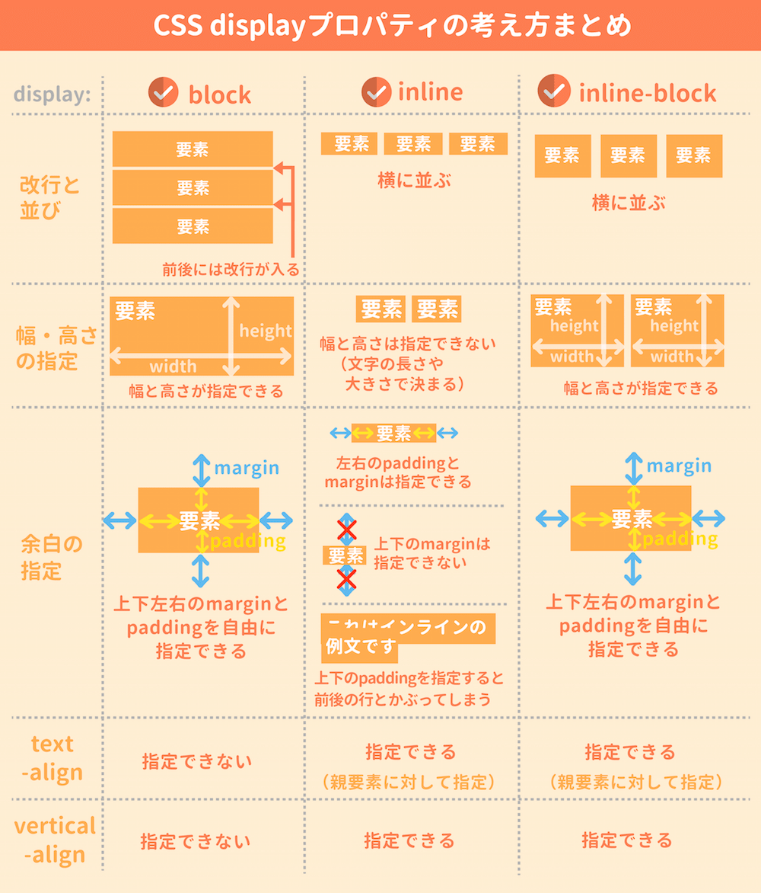

# CSS 編

## 宣言方法

- インライン(内部)スタイルシート
  - 構文　`<タグ名 style=" 宣言 ">`
    - 例　`<p style="color: red;">`
- 外部スタイルシート
  - CSS ファイルで CSS を宣言し，HTML ファイルの link タグで読み込む

ファイル名.html

```
  <head>
    <link rel="stylesheet" href="ファイル名.css">
  <head>
```

ファイル名.css

```
p { color: red; }
```

---

## 宣言

- 構文　`プロパティ: プロパティ値`
- 例　`color: red;`

---

## セレクタ（基礎編）

### タイプセレクタ

- 構文　`タグ名 { 宣言 }`
- 例　`div { color: red; }`
- 例　`p,h1 { color: red; }`

### class セレクタ

- 構文　`.クラス名 { 宣言 }`
- 例　`.item { color: red; }`
- 例　`.item.item-1 { color: black; }`

### id セレクタ

- 構文　`#id 名 { 宣言 }`
- 例　`#item { color: red; }`

## セレクタ（応用編）

### ユニバーサルセレクタ

- 構文　`* { 宣言 }`
- 例　`* { color }`
- 例　`p * { color: red; }`

### 存在や値によるセレクタ

- 属性セレクタ

  - 構文　`タグ名[属性] { 宣言 }`
  - 例　`a[href] { color: red; }`

- 部分文字列一致セレクター (全文一致)

  - 例　`a[href="https://www.google.com"] { color: red; }`

- 部分文字列一致セレクター (前方一致)

  - 例　`a[href^="https://www"] { color: red; }`

- 部分文字列一致セレクター (部分一致)

  - 例　`a[href*="google"] { color: red; }`

- 部分文字列一致セレクター (後方一致)

  - 例　`a[href$=".co.jp"] { color: red; }`

### 疑似クラスや疑似要素によるセレクタ

- :first-child, :first-of-type
- :last-child, :last-of-type
- :nth-child, :nth-of-type
- :not
- :hover
- ::after, ;;before
- ::first-line
- ::first-letter

---

## ボックスモデル

### ボックスモデルの基本

- Content box
- Padding box
- Border box
- Margin box
- box-sizing プロパティ

```
.item{
    /* Content box */
    width: 200px;
    height: 200px;

    /* Padding box */
    padding: 8px 12px 16px 20px;

    /* Border box */
    border: 2px solid black;

    /* Margin box */
    margin: 8px 12px 16px 20px;

}
```

各要素のボックスモデルは GoogleDevTool をつかって視覚的に確認できる．

---

## ブロックボックスとインラインボックス

### ブロックレベル要素

見出し・段落・表など, 文書を構成する基本となる要素で, 一つのブロックとして認識される

```
<center>, <div>, <dl>, <form>, <h1>-<h6>, <hr>, <noframes>, <noscript>, <ol>, <p>, <table>, <ul> など
```

### インライン要素

ブロックレベル要素の内容として用いられる要素で, 文章の一部として扱われる．

インライン要素の性質

- width, height プロパティが効かない
- インライン要素内で padding, border, margin が宣言されていれば，他の要素のことを考えない（上書きされるような感じになる）

```
<a>, <br>, <font>, , <input>, <label>, <select>, <small>, <span>, <strong>, <textarea> など
```

### 配置ルール

- ブロックレベル要素内で，他のブロックレベル要素やインライン要素は配置できる
- インライン要素内で，文字データや他のインライン要素は配置できる
- インライン要素内で，ブロックレベル要素は配置できない

### display プロパティ

- `display: inline;`と宣言すると，ブロックレベル要素をインライン要素に変更できる.

- `display: block;`と宣言すると，インライン要素をブロックレベル要素に変更できる.

- `display: inline-block;`と宣言すると，要素の並び方は inline 的で，要素の中身は block 的に変更できる.

<!--  -->


> [https://saruwakakun.com](https://saruwakakun.com/html-css/basic/display#section4)
> より引用

---

## Flexbox

### 記述方法

```
div {
    display: flex;
    (ここにFlexbox構文を記述)
}
```

### よく使われるプロパティ

| タグ            | 意味                                             | value                                                         |
| --------------- | ------------------------------------------------ | ------------------------------------------------------------- |
| justify-content | 横並びの位置を指定                               | flex-start,flex-end,center,space-between,space-around         |
| align-items     | 複数行にまたがった縦並びの位置を指定             | flex-start,flex-end,center,space-between,space-around,stretch |
| flex-direction  | Flex container 内の item の並びを縦か横に設定    | row,row-reverse,column,column-reverse                         |
| order           | Flex item の並び順を指定                         | 整数値                                                        |
| align-self      | auto,flex-start,flex-end,center,baseline,stretch | Flex item の縦並び位置を指定                                  |
| flex-wrap       | Flex container 内の item の折り返しの指定        | nowrap,wrap,wrap-reverse                                      |

### 参考教材

[Flexbox レイアウトまとめ - Qiita](https://qiita.com/takanorip/items/a51989312160530d89a1)

[Flexbox の全プロパティと使い方｜レンタルサーバーナレッジ](https://knowledge.cpi.ad.jp/tech/212/)

[CSS Flexbox の基礎知識と使い方をやさしく解説 - coliss ](https://coliss.com/articles/build-websites/operation/css/css3-flexbox-properties-by-scotch.html)

[Web クリエイターボックス](https://www.webcreatorbox.com/tech/css-flexbox-cheat-sheet)

---

## 参考教材

[しまぶーの IT 大学 CSS 基礎編 - Youtube再生リスト](https://www.youtube.com/playlist?list=PLwM1-TnN_NN5jWN09yjtxWng2XZa88ate)

---

## CSS ライブラリ

### Bootstrap

[公式ドキュメント](https://getbootstrap.jp/docs/5.0/getting-started/introduction/)
